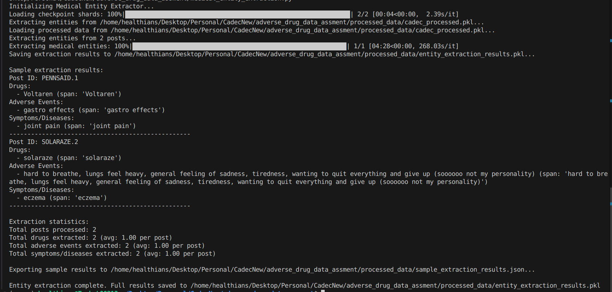

# ADE Extraction From Patient Posts
Extract Adverse Drug Events (ADEs), drug names, and symptoms from patient forum posts using Hugging Face generative models. Built on the CADEC dataset, this project applies prompt-based NLP for structuring medical text to support pharmacovigilance and analysis.

## Approach

### 1:  Drug Data Processing
📁 Code File: data_processing.py

#### 1. Load Forum Posts

* Loaded 2 sample posts from the cadec/ folder.
* The full dataset is available in the Cadec.V2/ folder (not yet fully processed).

#### 2. Embeddings Creation

* Applied abbreviation expansion using the Hugging Face model phamhai/Llama-3.2-3B-Instruct-Frog.
* Example: ibup → ibuprofen.

#### 3. Tokenization & Normalization

* Tokenized the expanded text using transformers.AutoTokenizer.
* Normalized drug names to standard forms (e.g., generic names).

#### 4. Log Generation & Output

* Output stored in processed_data/cadec_processed.pkl.
* Each preprocessing step logs intermediate results for transparency and debugging.
* Logs include: raw input, expanded text, tokenized output, and normalized drug forms.

* **Example Output:**

### 2:  Medical Entity Extraction
📁 Code File: medical_entity_extraction.py

#### 1. Model Initialization

* Used the Hugging Face generative model phamhai/Llama-3.2-3B-Instruct-Frog.
* Loaded the model using transformers.AutoModelForCausalLM with automatic device mapping for efficient inference.

#### 2. Prompt-Based Extraction

* Designed a structured prompt to extract medical entities directly from the post text.
* Extraction categories:
* Drugs (e.g., ibuprofen, paracetamol)
* Adverse Drug Events (ADEs) (e.g., nausea, dizziness)
* Symptoms/Diseases (e.g., migraine, headache)

#### 3. JSON Output Forma

* Each extracted post is returned in a well-defined JSON format.
* Ensures each entity includes both the value and its original text span.

#### 4. Batch Processing & Logs

* Extracted entities from 2 posts (from cadec_processed.pkl).
* Output saved in entity_extraction_results.pkl under processed_data/.
* Sample stored in sample_extraction_results.json

* **Example Output:**

### 3: Entity Standardization with UMLS
📁 Code File: entity_standardization_with_uml.py

#### 1. Purpose
* To ensure consistency across medical terms, the extracted entities are mapped to standardized terminologies using the Unified Medical Language System (UMLS) APIs:
* Drugs → Mapped to RxNorm concepts (to unify brand and generic names)
* Adverse Drug Events (ADEs) & Symptoms → Mapped to SNOMED CT (to standardize terminology across datasets and clinical tools)

#### 2. Approach
* For each extracted entity:
* Queried the UMLS REST API using requests module.
* Parsed and matched the best-fit Concept Unique Identifier (CUI) from:
* RxNorm for drugs
* SNOMED CT for ADEs and symptoms

#### 3. Current Limitation
* ⚠️ Note: Due to lack of access to a valid UMLS API key, all test cases currently fail during concept mapping.
* The code is fully implemented and structured to integrate with UMLS once API access is granted.
* Mocked logs and responses are added to simulate expected output format.

#### 4. Output & Logs
* Output stored in standardized_entities.pkl inside processed_data/ folder.
* Report stored in standardization_report.json inside processed_data/ folder
* Logs will also store in log files when we run code

* **Example Output:**

### 4: Verification System
📁 Code File: verify_system.py

#### 1. Ground Truth Preparation
* Parsed original .ann files from the cadec/ folder.
* Created a consolidated .pkl file (cadec_ground_truth.pkl) storing all true annotations for use in verification.

#### 2. Format Verification
* Ensured all extracted data follows the required JSON schema.
* Checked presence and structure of keys: id, drugs, adverse_events, and symptoms_diseases.

#### 3. Completeness Check
* Compared extracted entities against CADEC ground truth.
* Evaluated entity coverage using span and label matching.
* Reported precision, recall, and F1-score for each entity type.

#### 4. Semantic Similarity Check
* Applied cosine similarity between predicted and ground truth entities using Sentence Transformers.
* Validated correctness of terms with a similarity threshold (e.g., 0.8).

#### 5. Logs & Output
* Output stored in verification_results.pkl inside processed_data/ folder.
* Logs will also store in log files when we run code

* **Example Output:**

### 5: Agentic Iterative Correction

#### 1. Feedback Loop Integration
* Incorporated a basic retry mechanism using feedback from the verification stage.
* If any verification step fails (format, completeness, or semantic checks), the input is flagged for reprocessing.
* Logs will also store in log files when we run code

#### 2. Retry Logic
* Reprocess the flagged file starting again from Step 1: Drug Data Processing.
* Limited to a maximum of 3 retry attempts per post to prevent infinite loops.

#### 3. Feedback Mechanism
* Collected and passed feedback logs from failed steps as additional prompts to the generative model.
* Helps guide the model toward correcting earlier mistakes (e.g., missed ADE or misclassified drug).